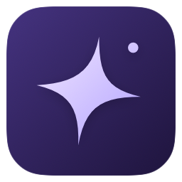

  

<h1 align="center">Lore</h1>

<strong>Remember what you built.</strong>

A native Mac app for your AI-assisted development history.

macOS 15+ · Apple Silicon · Local-first · Free &amp; open source

<a href="#what-you-can-do">Features</a> · <a href="https://github.com/wassimkanze/Lore/releases/latest">Download</a> · <a href="SUPPORT.md">Support Lore</a>

Keep working with your usual coding tools. Lore brings your local AI sessions, Git commits and project activity into one place, so you can revisit what you worked on and pick up where you left off.

## What you can do

### Revisit your work

Explore a calendar of your activity. Pick a day to see its projects, sessions and commits, then open the details or jump back to the original Codex chat.

### Keep your projects connected

See which agents and models you used, available token counts, and the files and lines changed in Git commits. Browse a project's history or mark it as a favorite for quick access.

### Follow your agents beside the notch

A single animated star shows live agent activity. Hover for a quick glance, click for details, and see when recorded signals indicate work, a question or completion. Pin the panel when you want to keep it open.

### Keep long tasks running with Pulse

Pulse keeps your Mac awake while your agents work — with the lid open or closed, on battery or charger. Choose a duration, save a preset, and control it from the app, menu bar or heartbeat beside the notch.

Lid-closed mode includes automatic stops for low battery, excessive heat and lost contact with Lore. Keep the Mac on a ventilated surface while it works.

### Make Lore feel like yours

Choose light, dark or system appearance, pick an accent color, adjust activity density and hover timing, or reduce animations. Your preferences stay on your Mac.

## Your data stays on your Mac

- No account required to use Lore.
- No analytics, telemetry, cloud sync or AI API calls.
- Your projects and agent files are read-only.
- Prompts, responses and source code are not saved in Lore's database.
- You choose which development folders Lore can read.

Lore stores activity metadata locally. Token counts and activity duration are observations from the available history, not billing figures or productivity scores.

## Supported tools

| Tool | Local history |
| --- | --- |
| Codex | Sessions, models, available token usage and direct chat links |
| Claude Code | Sessions, models and available token usage |
| Gemini CLI | Sessions from supported local history files |
| Git | Commits, authors, messages and change statistics |

Live status depends on what each tool records. See the [integration notes](Docs/Integrations.md) for format coverage and limitations.

## Get Lore

Lore runs on **Apple Silicon Macs with macOS 15 or newer**.

**[Download Lore for Apple Silicon →](https://github.com/wassimkanze/Lore/releases/latest)**

Unzip the download, drag **Lore.app** into **Applications**, and open it. No Xcode or developer account is needed. The app is Developer ID–signed and notarized by Apple.

Choose your development folders to add Git history. To keep working with the lid closed, enable system access from the Pulse page; macOS handles the approval.

Prefer to compile it yourself? See [Build Lore from source](CONTRIBUTING.md#build-lore).

## Support Lore

Lore is free. Optional support helps fund development and maintenance — it never unlocks features or changes the app you receive.

**[Support Lore →](SUPPORT.md)**

Sharing the project, reporting a bug or helping with code, documentation and design also makes a difference.

## Contribute

Ideas and contributions are welcome. Start with the [contributing guide](CONTRIBUTING.md), explore the [architecture](Docs/Architecture.md), or [open an issue](https://github.com/wassimkanze/Lore/issues).

## License

Lore is open source under the [MIT License](LICENSE).
